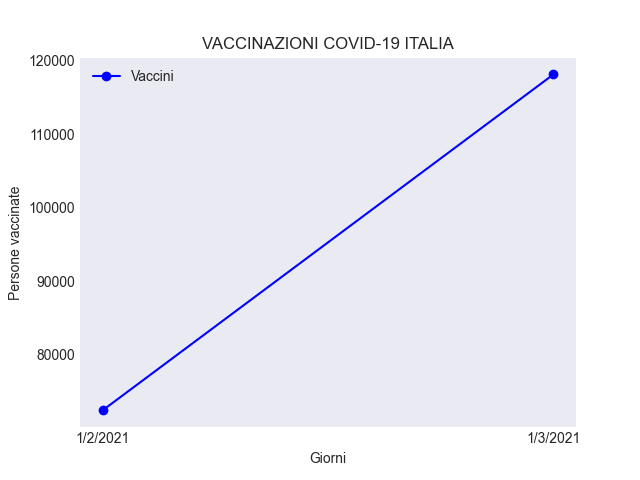
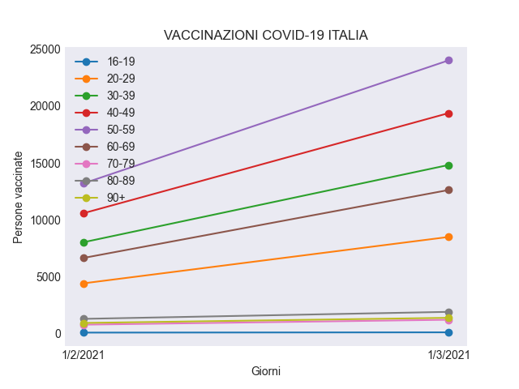

# covid19-vaccines-italy
Classe python che processa i dati presi da https://github.com/ondata/covid19italia per la creazione di output automatico e grafici. 

⚠️ ATTENZIONE

I dati non sono forniti ufficialmente dalla protezione civile italiana, potrebbero non essere sempre corretti/aggiornati con grande precisione

## Dependencies 📚
```
matplotlib
requests
```

## Quickstart 🚀

```python
# importa la classe dal file
from vaccines import Vaccines
v = Vaccines()

# Stampa il numero totale delle persona vaccinate
# il numero è restituito come int
print(v.totale_vaccinati)

# Stampa il totale dei vaccinati per categoria
# Personale sanitario, ospiti, [...]
# il valore ritornato è una stringa
print(v.categoria)

# Stampa i dati sui vaccini per tutte le regioni
# come dosi, persone vaccinate, percentuale, [...]
# il valore ritornato è una stringa
print(v.regioni)

# Stampa i dati sui vaccini per una regione fornita
# come argomento della funzione, consultare il README
# per gli argomenti accettati
# il valore ritornato è una stringa
print(v.get_regione("Lombardia"))

# Stampa i dati delle persone vaccinate 
# divise per fasce d'età
# il valore ritornato è una stringa
print(v.fasce_eta)

# Crea un grafico sull'andamento delle
# vaccinazioni basato sulle somministrazioni
# totali
v.get_grafico()

# Crea un grafico sull'andamento delle 
# vaccinazioni basato sulle somministrazioni
# per fascia d'età
v.get_grafico_fasce()
```

## get_regione("Inserire regione") 🤖

Gli argomenti accettati sono:
```bash
1: Abruzzo                       12: P.A. Bolzano
2: Basilicata                    13: P.A. Trento
3: Calabria                      14: Piemonte
4: Campania                      15: Puglia
5: Emilia-Romagna                16: Sardegna
6: Friuli Venezia Giulia         17: Sicilia
7: Lazio                         18: Toscana
8: Liguria                       19: Umbria
9: Lombardia                     20: Valle d\'Aosta
10: Marche                       21: Veneto
11: Molise
```

## Grafici

Le date usate nei grafici usano il formato MESE/GIORNO/ANNO

v.get_grafico()




v.get_grafico_fasce()


